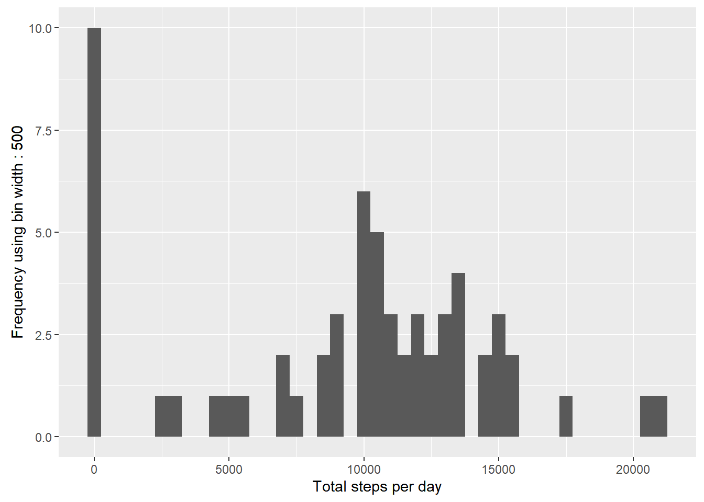
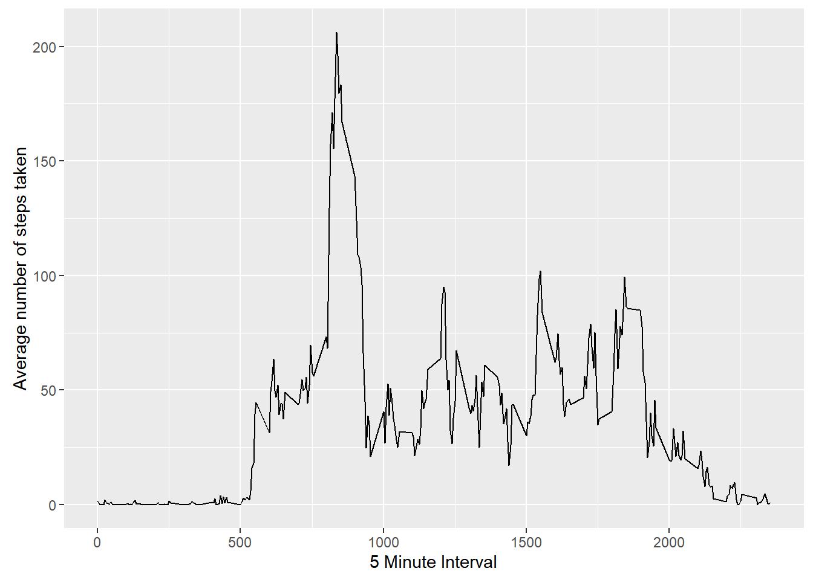
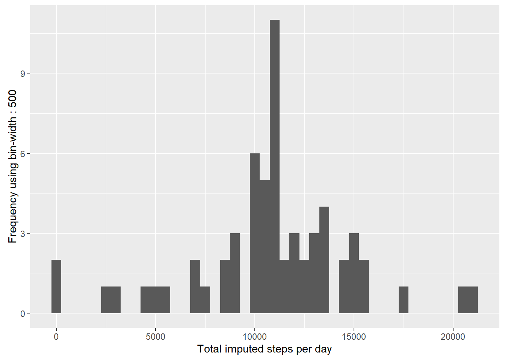
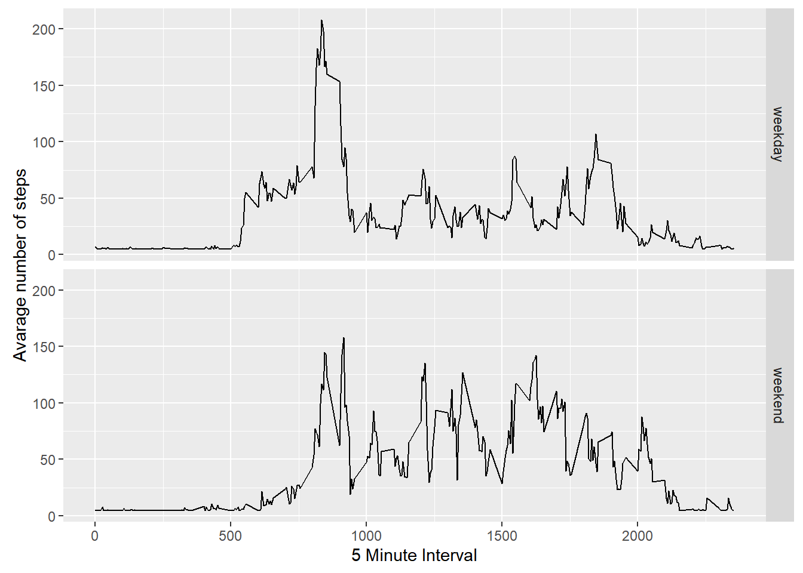

# Reproducible Research: Peer Assessment 1


## Load and process the data
##### 1. Load the data 

```{r, echo=FALSE, results='hide', warning=FALSE, message=FALSE}
library(ggplot2)
library(scales)
library(Hmisc)
```

```{r, results='markup', warning=TRUE, message=TRUE}
if(!file.exists('activity.csv')){
    unzip('activity.zip')
}
actdata <- read.csv('activity.csv')
```

##### 2. Transform the interval data

```{r}
#actdata$interval <- strptime(gsub("([0-9]{1,2})([0-9]{2})", "\\1:\\2", actdata$interval), format='%H:%M')
```

-----

## Mean total number of steps taken per day.

```{r}
steps_per_day <- tapply(actdata$steps, actdata$date, sum, na.rm=TRUE)
```

##### 1. Histogram of the total number of steps taken each day

```{r}
qplot(steps_per_day, xlab='Total steps per day', ylab='Frequency using bin width : 500', binwidth=500)
```



##### 2. Mean and median total number of steps taken per day

```{r}
steps_mean_per_day <- mean(steps_per_day)
steps_median_per_day <- median(steps_per_day)
```
* Mean: 9354.2295082 
* Median: 10395

-----

## Average daily activity pattern?

```{r}
avgesteps_per_timeblock <- aggregate(x=list(meanSteps=actdata$steps),
                                           by=list(interval=actdata$interval), FUN=mean, na.rm=TRUE)
```

##### 1. Plot for Time Series

```{r}
ggplot(data=avgesteps_per_timeblock, aes(x=interval, y=meanSteps)) +
    geom_line() +
    xlab("5 Minute Interval") +
    ylab("Average number of steps taken") 
```



##### 2. Five Minute Interval on average across all the days in the dataset that contains the maximum number of steps?

```{r}
most_steps <- which.max(avgesteps_per_timeblock$meanSteps)
time_for_most_steps <-  gsub("([0-9]{1,2})([0-9]{2})", "\\1:\\2", avgesteps_per_timeblock[most_steps,'interval'])
```

* Most Steps at: 8:35

----

## Missing values
##### 1. The total number of missing values in the dataset 

```{r}
number_of_missing_values <- length(which(is.na(actdata$steps)))
```

* Number of missing values: 2304

##### 2. Devise a strategy for filling in all of the missing values in the dataset.
##### 3. Create a new dataset that is equal to the original dataset but with the missing data filled in.


```{r}
activityData_imputed <- actdata
activityData_imputed$steps <- impute(actdata$steps, fun=mean)
```

##### 4. Histogram for the total number of steps taken each day 

```{r}
steps_each_day_imputed <- tapply(activityData_imputed$steps, activityData_imputed$date, sum)
qplot(steps_each_day_imputed, xlab='Total imputed steps per day',
                              ylab='Frequency using bin-width : 500', binwidth=500)
```



##### ... Calculate and report the mean and median total number of steps taken per day. 

```{r}
steps_per_day_mean_imputed <- mean(steps_each_day_imputed)
steps_per_day_median_imputed <- median(steps_each_day_imputed)
```
* Mean (Imputed): 1.0766189 &times; 10<sup>4</sup>
* Median (Imputed):  1.0766189 &times; 10<sup>4</sup>

----

## Are there differences in activity patterns between weekdays and weekends?
##### 1. Create a new factor variable in the dataset with two levels "weekday" and "weekend" indicating whether a given date is a weekday or weekend.

```{r}
activityData_imputed$dateType <- ifelse(as.POSIXlt(activityData_imputed$date)
                                                  $wday %in% c(0,6), 'weekend', 'weekday')
```

##### 2. Panel plot containing a time series plot

```{r}
avgd_activity_DataImputed <- aggregate(steps ~ interval + dateType, data=activityData_imputed, mean)

ggplot(avgd_activity_DataImputed, aes(interval, steps)) + 
    geom_line() + 
    facet_grid(dateType ~ .) +
    xlab("5 Minute Interval") + 
    ylab("Avarage number of steps")
```


